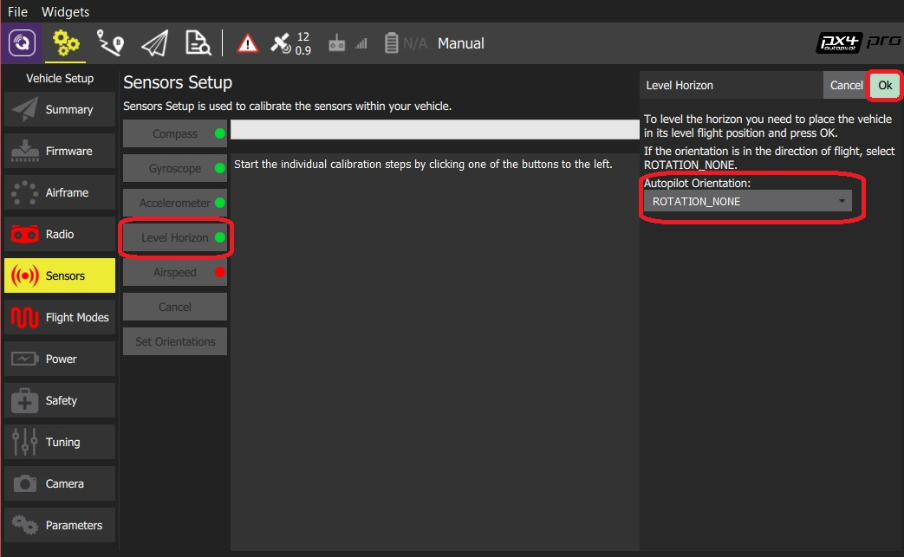

# 水平平面校准

您可以使用 *Level Horizon Calibration* 补偿飞行控制器方向中小错点，在 *QGroundControl* 飞行视图中（上部为蓝色，下部为绿色）稳定飞行视图中的地平线。

> **Tip** 非常建议校准水平面，从而获得最佳的飞行性能。 如果您注意到飞行期间发生恒定漂移，也可以重复这个过程。

## 执行校准

执行校准步骤：

1. 打开 *QGroundControl* 并连接上飞机。
2. 在工具栏选择 **齿轮** 图标 (机体设置)，然后在侧边栏选择 **传感器**。
3. 点击 **Level Horizon** 按钮。  > **Note** 您应该已经设置好 [Autopilot Orientation](../config/flight_controller_orientation.md)。 如果没有，也可以在这里设置。 
4. 将飞行器放置于水平方向： 
    * 这是飞行器在水平飞行时的位置（飞行器通常会向上轻微翘起！）
    * 对于旋翼机，这是悬停位置。
5. 点击 **OK** 开始校准。
6. 等待校准过程结束。

## 验证

在方向设置和水平校准完成后，检查飞行视图，当飞行器朝向北方时罗盘朝向值为0，地平线是水平的（上部为蓝色，下部为绿色）。

## 更多信息

* [Advanced Orientation Tuning](../advanced_config/advanced_flight_controller_orientation_leveling.md)（仅高级用户）。
* [QGroundControl 用户手册 > 传感器](https://docs.qgroundcontrol.com/en/SetupView/sensors_px4.html#level-horizon)
* [PX4 Setup Video - @1m14s](https://youtu.be/91VGmdSlbo4?t=1m14s) (Youtube)